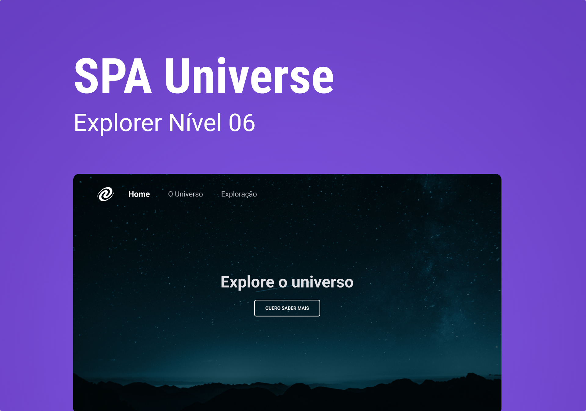

## SPA Universe

### Sobre

Este repositório é um pequeno projeto para colocar em prática os conceitos de SPA (Single Page Application), eventos no JavaScript, assincronismo, promises, conceitos de POO (Programação Orientada a Objetos) como classes, herança e polimorfismo.

### Pré-requisitos

Antes de começar, certifique-se de que preenche os seguintes requisitos:

- [Git](https://git-scm.com/downloads "Download Git") deve estar instalado no seu sistema operacional.
- [Node.js LTS v16.14](https://nodejs.org/en "Download Node.js LTS v16") essa versão deve estar instalado no seu sistema operacional ou qualquer versão superior.